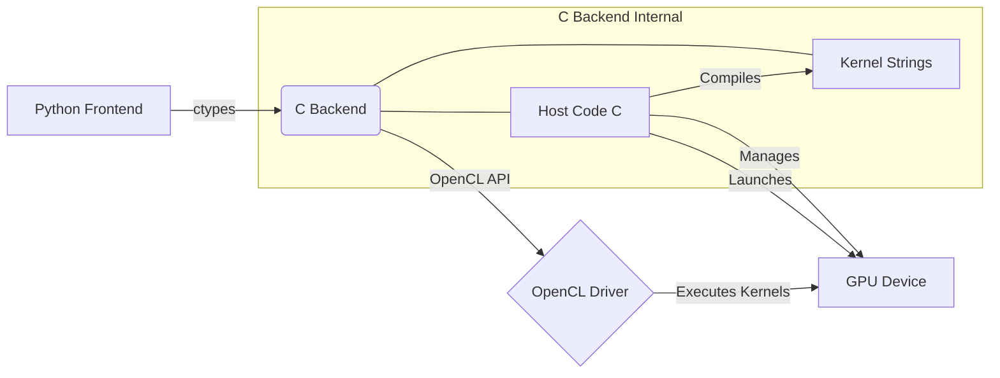

# OCL-LLM: OpenCL-Accelerated LLM Framework (Ultimate Build Attempt 8 - GPU Cross Entropy)

**Eine grundlegende, von Grund auf neu entwickelte Bibliothek zur Beschleunigung von Operationen für Large Language Models (LLMs) mithilfe von OpenCL, mit Python-Bindings und automatischer Differenzierung (Autograd).**

[](https://opensource.org/licenses/MIT) <!-- Beispiel-Badge -->

---

**Inhaltsverzeichnis**

1.  [Einleitung](#1-einleitung)
2.  [Hauptmerkmale](#2-hauptmerkmale)
3.  [Motivation & Ziele](#3-motivation--ziele)
4.  [Projektarchitektur](#4-projektarchitektur)
    *   [C/OpenCL Backend (`driver.dll`/`.so`)](#copencl-backend-driverdllso)
    *   [Python Frontend (`ocl_framework.py`)](#python-frontend-ocl_frameworkpy)
5.  [Installation & Setup](#5-installation--setup)
    *   [Voraussetzungen](#voraussetzungen)
    *   [Kompilierung des C-Backends](#kompilierung-des-c-backends)
    *   [Python-Umgebung](#python-umgebung)
6.  [Verwendung](#6-verwendung)
    *   [Training starten](#training-starten)
    *   [Checkpoints laden/speichern](#checkpoints-ladenspeichern)
    *   [Konfiguration](#konfiguration)
    *   [Inferenz](#inferenz)
7.  [API Dokumentation](#7-api-dokumentation)
    *   [C Backend API (`driver.dll`/`.so`)](#c-backend-api-driverdllso)
        *   [Initialisierung & Shutdown](#initialisierung--shutdown)
        *   [Speicherverwaltung](#speicherverwaltung)
        *   [Datenübertragung](#datenübertragung)
        *   [Kernausführung (Forward Pass)](#kernausführung-forward-pass)
        *   [Kernausführung (Backward Pass)](#kernausführung-backward-pass)
        *   [Kernausführung (Optimizer)](#kernausführung-optimizer)
        *   [Hilfsfunktionen (Simulation/Info)](#hilfsfunktionen-simulationinfo)
    *   [Python Frontend API (`ocl_framework.py`)](#python-frontend-api-ocl_frameworkpy)
        *   [`GPUBuffer` Klasse](#gpubuffer-klasse)
        *   [`OclTensor` Klasse](#ocltensor-klasse)
        *   [Tensor Operationen](#tensor-operationen)
        *   [Autograd Context Klassen](#autograd-context-klassen)
        *   [Layer Definitionen](#layer-definitionen)
        *   [`SimpleModel` Klasse](#simplemodel-klasse)
        *   [`AdamOptimizer` Klasse](#adamoptimizer-klasse)
        *   [`TinyTokenizer` Klasse](#tinytoknizer-klasse)
        *   [Hilfsfunktionen (Init, Shutdown, Loss, Checkpoint)](#hilfsfunktionen-init-shutdown-loss-checkpoint)
8.  [OpenCL Kernel Erklärungen](#8-opencl-kernel-erklärungen)
    *   [Matrixmultiplikation (Standard & Batched)](#matrixmultiplikation-standard--batched)
    *   [Softmax & LogSoftmax](#softmax--logsoftmax)
    *   [Cross Entropy Loss & Gradient](#cross-entropy-loss--gradient)
    *   [GELU (Forward & Backward)](#gelu-forward--backward)
    *   [Elementweise Operationen (Add, Mul, Backward)](#elementweise-operationen-add-mul-backward)
    *   [Layer Normalization (Forward & Backward)](#layer-normalization-forward--backward)
    *   [Transpose (Basic, Batched, 1<->2)](#transpose-basic-batched-1-2)
    *   [Embedding Lookup & Backward (Scatter-Add)](#embedding-lookup--backward-scatter-add)
    *   [Reduce Sum (Bias Gradient)](#reduce-sum-bias-gradient)
    *   [Broadcast Add (Bias, Positional Encoding)](#broadcast-add-bias-positional-encoding)
    *   [Adam Optimizer Update](#adam-optimizer-update)
9.  [Autograd System](#9-autograd-system)
10. [Beitrag](#10-beitrag)
11. [Lizenz](#11-lizenz)
12. [FAQ (Häufig gestellte Fragen)](#12-faq-häufig-gestellte-fragen)
13. [Glossar](#13-glossar)
14. [Zukünftige Arbeit & Roadmap](#14-zukünftige-arbeit--roadmap)

---

## 1. Einleitung

OCL-LLM ist ein Framework, das grundlegende Operationen für das Training und die Inferenz von Transformer-basierten Large Language Models (LLMs) mithilfe von OpenCL implementiert. Das Ziel ist es, eine GPU-Beschleunigung auf einer breiteren Palette von Hardware (einschließlich AMD, Intel und älterer NVIDIA-Karten) zu ermöglichen, die möglicherweise keine optimale CUDA-Unterstützung haben.

Das Projekt umfasst eine C-Bibliothek mit OpenCL-Kerneln für Kernoperationen und eine Python-Schicht, die `ctypes` verwendet, um diese C-Funktionen aufzurufen. Darüber hinaus implementiert es ein einfaches System für die automatische Differenzierung (Autograd), das es ermöglicht, Gradienten für das Training von Modellen zu berechnen.

Dieses Dokument dient als umfassende Dokumentation für das Projekt, einschließlich der API-Details, Kernel-Erklärungen und Anwendungsbeispiele.

## 2. Hauptmerkmale

*   **OpenCL-Beschleunigung:** Nutzt OpenCL 1.2+ für die GPU-Beschleunigung von rechenintensiven Operationen.
*   **Kernoperationen:** Implementiert wesentliche LLM-Operationen:
    *   Matrixmultiplikation (Standard, Broadcasted 3D@2D, Batched 3D@3D)
    *   Elementweise Operationen (Addition, Multiplikation)
    *   Aktivierungsfunktionen (GELU, Softmax, LogSoftmax)
    *   Normalisierung (Layer Normalization)
    *   Tensor-Manipulation (Transpose, Reshape, Clone)
    *   Embedding Lookup (CPU & optional GPU)
    *   Cross Entropy Loss & Gradient (CPU & optional GPU)
    *   Adam Optimizer Update (GPU)
*   **Automatische Differenzierung:** Integriertes Autograd-System zur Berechnung von Gradienten für das Modelltraining.
*   **Python Interface:** Einfach zu verwendende Python-API (`OclTensor`) für die Interaktion mit den GPU-Operationen und dem Autograd-System.
*   **Grundlegende Modellarchitektur:** Enthält Klassen für grundlegende Transformer-Komponenten (Linear, Embedding, LayerNorm, MultiHeadAttention, TransformerBlock, PositionalEncoding) und ein einfaches Modell (`SimpleModel`).
*   **Checkpointing:** Funktionen zum Speichern und Laden des Modell- und Optimizer-Zustands.
*   **Flexibilität:** Entwickelt mit dem Fokus auf Verständlichkeit und Erweiterbarkeit.
*   **Plattformübergreifende Kompilierung (C):** Der C-Code verwendet Standard-C und OpenCL-Header, um die Kompilierung unter Linux und Windows zu erleichtern.

## 3. Motivation & Ziele

Die Hauptmotivation hinter OCL-LLM ist das Lernen und Experimentieren mit den Kernkomponenten von LLMs und deren GPU-Beschleunigung mithilfe einer weit verbreiteten, herstellerneutralen API wie OpenCL.

**Ziele:**

1.  **Verständnis:** Ein tiefes Verständnis dafür entwickeln, wie LLM-Operationen auf einer niedrigen Ebene implementiert und auf GPUs ausgeführt werden.
2.  **Zugänglichkeit:** GPU-Beschleunigung für Benutzer ermöglichen, die möglicherweise keine NVIDIA-Hardware der neuesten Generation besitzen.
3.  **Grundlage:** Eine Basis schaffen, auf der komplexere Modelle und Techniken aufgebaut werden können.
4.  **Leistung:** Obwohl nicht primär auf Spitzenleistung optimiert, soll eine signifikante Beschleunigung gegenüber reinen CPU-Implementierungen erreicht werden.
5.  **Eigenständigkeit:** Ein möglichst autarkes Framework (abgesehen von OpenCL-Treibern und NumPy) bereitstellen.

## 4. Projektarchitektur

Das Projekt ist in zwei Hauptschichten unterteilt:

### C/OpenCL Backend (`driver.dll`/`.so`)

*   **Verantwortlichkeit:** Enthält die Kernlogik für GPU-Operationen.
*   **Komponenten:**
    *   **OpenCL Host Code:** C-Funktionen, die die OpenCL-Umgebung initialisieren (Plattform, Gerät, Kontext, Queue), OpenCL-Kernel kompilieren, Speicherpuffer auf der GPU verwalten (allokieren, freigeben, schreiben, lesen) und Kernel-Ausführungen anstoßen.
    *   **OpenCL Kernels:** Zeichenketten (`const char *`), die den eigentlichen Code enthalten, der auf der GPU ausgeführt wird (z. B. `matrix_multiply`, `softmax_rowwise`, `adam_update`). Diese sind in der C-Datei eingebettet.
    *   **Exportierte API:** Eine Reihe von C-Funktionen (markiert mit `DLLEXPORT`), die von Python über `ctypes` aufgerufen werden können. Diese kapseln die OpenCL-Aufrufe.
*   **Daten Typ:** Verwendet hauptsächlich `FP_TYPE` (derzeit `float`) für Berechnungen auf der GPU, wobei Adam-Zustände `float` verwenden.


### Python Frontend (`ocl_framework.py`)

*   **Verantwortlichkeit:** Stellt eine benutzerfreundliche Schnittstelle zur C/OpenCL-Bibliothek bereit und implementiert das Autograd-System sowie die Modellarchitektur.
*   **Komponenten:**
    *   **ctypes Bindings:** Lädt die kompilierte C-Bibliothek (`driver.dll`/`.so`) und definiert die Signaturen (Argumenttypen, Rückgabetypen) für die exportierten C-Funktionen.
    *   **`GPUBuffer` Klasse:** Wrapper um OpenCL-Speicherpuffer (`cl_mem`), der die Allokation, Freigabe und Datenübertragung verwaltet.
    *   **`OclTensor` Klasse:** Hauptklasse für Benutzerinteraktion. Kapselt einen `GPUBuffer` und Metadaten (Shape, Datentyp). Implementiert Operationen (z. B. `matmul`, `add`), die die entsprechenden C-API-Funktionen aufrufen. Enthält die Logik für das Autograd-System (`requires_grad`, `grad`, `_ctx`, `backward`).
    *   **Autograd Context Klassen:** Spezifische Klassen (`MatMulBackwardContext`, `AddBackwardContext`, etc.), die während des Forward-Passes erstellt und im `_ctx`-Attribut des Ausgabe-Tensors gespeichert werden. Sie enthalten Referenzen auf die Eingabe-Tensoren und implementieren die `backward`-Methode, um die Gradienten für die Eingaben zu berechnen.
    *   **Layer-Klassen:** Bausteine für neuronale Netze (`Linear`, `Embedding`, `LayerNorm`, `MultiHeadAttention`, `TransformerBlock`, `PositionalEncoding`). Diese verwenden `OclTensor`-Operationen intern.
    *   **`SimpleModel` Klasse:** Ein Beispiel-Transformermodell, das die Layer kombiniert.
    *   **`AdamOptimizer` Klasse:** Implementiert den Adam-Optimierungsalgorithmus unter Verwendung des dedizierten `adam_update` OpenCL-Kernels.
    *   **`TinyTokenizer` Klasse:** Ein einfacher charakterbasierter Tokenizer.
    *   **Hilfsfunktionen:** Initialisierung (`ocl_initialize`), Bereinigung (`ocl_shutdown`), Checkpointing (`save_checkpoint`, `load_checkpoint`), Loss-Berechnung (`cross_entropy_loss_and_backward`).

## 5. Installation & Setup

### Voraussetzungen

1.  **C-Compiler:**
    *   **Linux:** GCC oder Clang (z.B. `sudo apt install build-essential`)
    *   **Windows:** MinGW (über MSYS2) oder Microsoft Visual Studio (mit C/C++ Build Tools).
2.  **OpenCL SDK & Treiber:**
    *   Du benötigst die OpenCL-Header (`CL/cl.h` etc.) und eine Laufzeitbibliothek (`OpenCL.dll` unter Windows, `libOpenCL.so` unter Linux).
    *   Installiere die neuesten Grafiktreiber für deine GPU (AMD, NVIDIA, Intel). Diese enthalten normalerweise die OpenCL-Laufzeit.
    *   Möglicherweise musst du zusätzlich ein OpenCL SDK installieren (z.B. von Intel, AMD oder über Paketmanager unter Linux wie `ocl-icd-opencl-dev` oder `opencl-headers`).
3.  **Python:** Python 3.7 oder höher.
4.  **NumPy:** `pip install numpy`

### Kompilierung des C-Backends

Das C-Backend muss zu einer Shared Library (`.dll` für Windows, `.so` für Linux) kompiliert werden.

**Methode 1: Direkte Kompilierung (Beispiel Linux/MinGW)**

```bash
# Ersetze <Pfad_zum_OpenCL_Include> und <Pfad_zur_OpenCL_Lib> entsprechend
# Beispiel für Linux:
gcc -shared -o driver.so driver.c -fPIC -O2 -Wall -Wextra -I/usr/include -L/usr/lib -lOpenCL -lm

# Beispiel für Windows mit MinGW (über MSYS2):
# Stelle sicher, dass die OpenCL Header und die .lib/.dll verfügbar sind.
# Pfade müssen angepasst werden! Z.B. für Intel SDK:
# INCLUDE_PATH="-IC:/Program Files (x86)/Intel/OpenCL SDK/7.0/include"
# LIB_PATH="-LC:/Program Files (x86)/Intel/OpenCL SDK/7.0/lib/x64" # Oder x86
# gcc -shared -o driver.dll driver.c -O2 -Wall -Wextra ${INCLUDE_PATH} ${LIB_PATH} -lOpenCL -lm
# Eventuell muss die OpenCL.dll noch in den Pfad kopiert oder der Systempfad angepasst werden.

# Beispiel für Windows mit MSVC (Developer Command Prompt):
# cl /LD driver.c /O2 /Wall /I"C:\Pfad\zu\OpenCL\include" "C:\Pfad\zu\OpenCL\lib\x64\OpenCL.lib" /link /OUT:driver.dll
```

**Methode 2: CMake (Empfohlen, falls eine `CMakeLists.txt` vorhanden wäre)**

(Hinweis: Das bereitgestellte Code-Snippet enthält keine `CMakeLists.txt`, aber so würde es prinzipiell aussehen)

```bash
mkdir build
cd build
cmake .. # Ggf. Pfade zu OpenCL angeben: cmake .. -DOpenCL_INCLUDE_DIR=/path/to/include -DOpenCL_LIBRARY=/path/to/libOpenCL.so
make
cd ..
# Die driver.dll/.so befindet sich dann im build-Verzeichnis oder einem Unterverzeichnis.
```

**Wichtig:** Platziere die kompilierte `driver.dll` oder `driver.so` im selben Verzeichnis wie das Python-Skript (`ocl_framework.py`) oder in einem Verzeichnis, das im Systempfad enthalten ist.

### Python-Umgebung

Stelle sicher, dass NumPy installiert ist:

```bash
pip install numpy
```

## 6. Verwendung

### Training starten

Führe das Python-Skript aus. Du kannst die zu verwendende GPU und optional einen Checkpoint zum Fortsetzen angeben:

```bash
# Standard (verwendet GPU 0)
python ocl_framework.py

# Bestimmte GPU verwenden
python ocl_framework.py --gpu_id 1

# Training von Checkpoint fortsetzen
python ocl_framework.py --load_checkpoint checkpoints/test_model.npz

# Checkpoints in einem anderen Verzeichnis speichern
python ocl_framework.py --save_dir /pfad/zu/meinen/checkpoints
```

### Checkpoints laden/speichern

*   **Speichern:** Checkpoints werden automatisch gespeichert, wenn sich der Validierungsverlust verbessert. Der Standardspeicherort ist ein Unterverzeichnis `checkpoints` im aktuellen Arbeitsverzeichnis. Der Dateiname ist in der `config` im Skript definiert (`checkpoint_filename`).
*   **Laden:** Verwende das `--load_checkpoint` Argument mit dem Pfad zur `.npz`-Datei. Das Training wird ab der im Checkpoint gespeicherten Epoche fortgesetzt.

### Konfiguration

Die Hauptkonfiguration (Modellgröße, Lerndetails, Dateipfade) wird direkt im Python-Skript (`ocl_framework.py`) im `config`-Dictionary festgelegt. Passe diese Werte nach Bedarf an:

*   `data_file`: Pfad zur Textdatei für das Training (z.B. `input.txt`).
*   `max_len`: Maximale Sequenzlänge.
*   `batch_size`: Anzahl der Sequenzen pro Trainingsschritt. Muss möglicherweise reduziert werden, wenn der GPU-Speicher knapp wird.
*   `embed_dim`, `num_heads`, `d_ff`, `num_layers`: Modellarchitekturparameter.
*   `lr`, `wd`: Lerndetails für den Adam-Optimizer.
*   `num_epochs`: Anzahl der Trainingsepochen.
*   `val_split`: Anteil der Daten, der für die Validierung verwendet wird.
*   `checkpoint_filename`: Name der Checkpoint-Datei (wird im `--save_dir` gespeichert).

### Inferenz

Das Skript führt am Ende des Trainings und periodisch währenddessen eine kurze Inferenz auf einem Testtext durch, um die Modellausgabe zu demonstrieren.

## 7. API Dokumentation

### C Backend API (`driver.dll`/`.so`)

Diese Funktionen werden direkt von der Python-Schicht über `ctypes` aufgerufen.

#### Initialisierung & Shutdown

*   **`int initialize_gpu(int gpu_index)`**
    *   **Zweck:** Initialisiert die OpenCL-Umgebung für das angegebene GPU-Gerät. Sucht Plattformen und Geräte, erstellt einen Kontext und eine Command Queue. Kompiliert *alle* im C-Code definierten OpenCL-Kernel. Prüft auf FP64- und Atomics-Unterstützung.
    *   **Parameter:**
        *   `gpu_index` (int): Der Index des zu verwendenden OpenCL-Geräts (beginnend bei 0). Wird automatisch auf 0 gesetzt, wenn der Index ungültig ist.
    *   **Rückgabe:** `1` bei Erfolg, `0` bei Fehler.
    *   **Hinweis:** Muss vor allen anderen GPU-Operationen aufgerufen werden.

*   **`void shutdown_driver()`**
    *   **Zweck:** Gibt alle OpenCL-Ressourcen frei (Kernel, Programme, Command Queue, Kontext).
    *   **Parameter:** Keine.
    *   **Rückgabe:** Keine.
    *   **Hinweis:** Sollte am Ende der Anwendung aufgerufen werden, um Speicherlecks zu vermeiden.

#### Speicherverwaltung

*   **`void *allocate_gpu_memory(int gpu_index, size_t size)`**
    *   **Zweck:** Allokiert einen Speicherpuffer auf dem initialisierten GPU-Gerät.
    *   **Parameter:**
        *   `gpu_index` (int): Wird derzeit nicht verwendet (Kontext ist global), aber für zukünftige Erweiterungen beibehalten.
        *   `size` (size_t): Die Größe des Puffers in Bytes.
    *   **Rückgabe:** Ein opaker Zeiger (`void*`, in Python als `c_void_p` behandelt) auf das `cl_mem`-Objekt bei Erfolg, `NULL` bei Fehler.
    *   **Hinweis:** Der Puffer wird mit `CL_MEM_READ_WRITE` erstellt.

*   **`void free_gpu_memory(int gpu_index, void* buffer_handle)`**
    *   **Zweck:** Gibt einen zuvor allokierten GPU-Speicherpuffer frei.
    *   **Parameter:**
        *   `gpu_index` (int): Derzeit nicht verwendet.
        *   `buffer_handle` (void*): Der von `allocate_gpu_memory` zurückgegebene Zeiger.
    *   **Rückgabe:** Keine.
    *   **Hinweis:** Versucht nicht, `NULL`-Zeiger freizugeben. Gibt eine Warnung aus, wenn `clReleaseMemObject` fehlschlägt (z.B. bei doppeltem Freigabeversuch).

#### Datenübertragung

*   **`int write_host_to_gpu_blocking(int gpu_index, void* gpu_buffer_handle, size_t offset, size_t size, const void* host_source_ptr)`**
    *   **Zweck:** Kopiert Daten von einem Host-Speicherbereich (z.B. NumPy-Array) in einen GPU-Puffer. Diese Operation ist blockierend.
    *   **Parameter:**
        *   `gpu_index` (int): Derzeit nicht verwendet.
        *   `gpu_buffer_handle` (void*): Handle des Ziel-GPU-Puffers.
        *   `offset` (size_t): Byte-Offset im GPU-Puffer, an dem das Schreiben beginnen soll.
        *   `size` (size_t): Anzahl der zu schreibenden Bytes.
        *   `host_source_ptr` (const void*): Zeiger auf die Quelldaten im Host-Speicher.
    *   **Rückgabe:** `1` bei Erfolg, `0` bei Fehler.

*   **`int read_gpu_to_host_blocking(int gpu_index, void* gpu_buffer_handle, size_t offset, size_t size, void* host_destination_ptr)`**
    *   **Zweck:** Kopiert Daten von einem GPU-Puffer in einen Host-Speicherbereich. Diese Operation ist blockierend.
    *   **Parameter:**
        *   `gpu_index` (int): Derzeit nicht verwendet.
        *   `gpu_buffer_handle` (void*): Handle des Quell-GPU-Puffers.
        *   `offset` (size_t): Byte-Offset im GPU-Puffer, an dem das Lesen beginnen soll.
        *   `size` (size_t): Anzahl der zu lesenden Bytes.
        *   `host_destination_ptr` (void*): Zeiger auf den Zielspeicherbereich im Host.
    *   **Rückgabe:** `1` bei Erfolg, `0` bei Fehler.

#### Kernausführung (Forward Pass)

Diese Funktionen reihen die Ausführung eines spezifischen OpenCL-Kernels in die Command Queue ein und *warten* auf dessen Fertigstellung (`clFinish`).

*   **`int execute_matmul_on_gpu(int gpu_index, void* buffer_a, void* buffer_b, void* buffer_c, int B, int M, int N, int K)`**
    *   **Zweck:** Führt die Standard-Matrixmultiplikation C = A @ B aus. Behandelt A als (B, M, K) oder (M, K) und B als (K, N). C ist (B, M, N) oder (M, N).
    *   **Kernel:** `matrix_multiply`
    *   **Parameter:** GPU-Handles für A, B, C; Dimensionen B, M, N, K.
    *   **Rückgabe:** `1` bei Erfolg, `0` bei Fehler.

*   **`int execute_softmax_on_gpu(int gpu_index, void* buffer_input, void* buffer_output, int num_rows, int row_size)`**
    *   **Zweck:** Wendet die Softmax-Funktion zeilenweise auf den Eingabe-Tensor an.
    *   **Kernel:** `softmax_rowwise`
    *   **Parameter:** Input/Output-Handles, Anzahl der Zeilen, Größe jeder Zeile.
    *   **Rückgabe:** `1` bei Erfolg, `0` bei Fehler.

*   **`int execute_gelu_on_gpu(int gpu_index, void* buffer_input, void* buffer_output, int num_elements)`**
    *   **Zweck:** Wendet die GELU-Aktivierungsfunktion elementweise an.
    *   **Kernel:** `gelu_elementwise`
    *   **Parameter:** Input/Output-Handles, Gesamtzahl der Elemente.
    *   **Rückgabe:** `1` bei Erfolg, `0` bei Fehler.

*   **`int execute_add_on_gpu(int gpu_index, void* buffer_a, void* buffer_b, void* buffer_c, int num_elements)`**
    *   **Zweck:** Führt elementweise Addition C = A + B durch.
    *   **Kernel:** `add_elementwise`
    *   **Parameter:** Handles für A, B, C; Gesamtzahl der Elemente.
    *   **Rückgabe:** `1` bei Erfolg, `0` bei Fehler.

*   **`int execute_mul_on_gpu(int gpu_index, void* buffer_a, void* buffer_b, void* buffer_c, int num_elements)`**
    *   **Zweck:** Führt elementweise Multiplikation C = A * B durch.
    *   **Kernel:** `mul_elementwise`
    *   **Parameter:** Handles für A, B, C; Gesamtzahl der Elemente.
    *   **Rückgabe:** `1` bei Erfolg, `0` bei Fehler.

*   **`int execute_layernorm_on_gpu(int gpu_index, void* buffer_input, void* buffer_output, int num_rows, int row_size, float eps)`**
    *   **Zweck:** Wendet Layer Normalization auf die letzte Dimension des Eingabe-Tensors an.
    *   **Kernel:** `layer_norm`
    *   **Parameter:** Input/Output-Handles, Anzahl der Zeilen, Größe der zu normalisierenden Dimension, Epsilon.
    *   **Rückgabe:** `1` bei Erfolg, `0` bei Fehler.

*   **`int execute_clone_on_gpu(int gpu_index, void* src_buffer, void* dst_buffer, size_t size)`**
    *   **Zweck:** Kopiert den Inhalt eines GPU-Puffers in einen anderen GPU-Puffer.
    *   **Kernel:** Verwendet `clEnqueueCopyBuffer` (kein benutzerdefinierter Kernel).
    *   **Parameter:** Quell- und Ziel-Handles, Größe in Bytes.
    *   **Rückgabe:** `1` bei Erfolg, `0` bei Fehler.

*   **`int execute_transpose_on_gpu(int gpu_index, void* buffer_input, void* buffer_output, int rows, int cols)`**
    *   **Zweck:** Transponiert eine 2D-Matrix.
    *   **Kernel:** `transpose`
    *   **Parameter:** Input/Output-Handles, Zeilen- und Spaltenanzahl der *Eingabe*.
    *   **Rückgabe:** `1` bei Erfolg, `0` bei Fehler.

*   **`int execute_embedding_lookup_gpu(int gpu_index, void* idx, void* w, void* o, int b, int s, int d, int v)`**
    *   **Zweck:** Führt Embedding-Lookup durch: `output[b, s, :] = weights[indices[b, s], :]`.
    *   **Kernel:** `embedding_lookup` (Optional, erfordert `HAS_EMBEDDING_LOOKUP`)
    *   **Parameter:** Handles für Index-Tensor (int32), Gewichtsmatrix, Output-Tensor; Dimensionen Batch (b), Sequenzlänge (s), Embedding-Dimension (d), Vokabulargröße (v).
    *   **Rückgabe:** `1` bei Erfolg, `0` bei Fehler oder wenn Kernel nicht verfügbar.

*   **`int execute_broadcast_add_gpu(int gpu_index, void* a, void* b, void* c, int B, int M, int N)`**
    *   **Zweck:** Führt Broadcast-Addition durch: C[b, m, n] = A[b, m, n] + B_bias[n].
    *   **Kernel:** `broadcast_add_bias`
    *   **Parameter:** Handles für A (B, M, N), B_bias (N), C (B, M, N); Dimensionen B, M, N.
    *   **Rückgabe:** `1` bei Erfolg, `0` bei Fehler.

*   **`int execute_transpose_batched_gpu(int gpu_index, void* in, void* out, int B_flat, int d1, int d2)`**
    *   **Zweck:** Transponiert die letzten beiden Dimensionen eines Tensors: (..., D1, D2) -> (..., D2, D1). Führende Dimensionen werden zu `B_flat` zusammengefasst.
    *   **Kernel:** `transpose_batched_last_two` (Optional, erfordert `HAS_TRANSPOSE_LAST_TWO`)
    *   **Parameter:** Input/Output-Handles; `B_flat` (Produkt der Batch-Dimensionen), `d1` (Größe Dim -2), `d2` (Größe Dim -1).
    *   **Rückgabe:** `1` bei Erfolg, `0` bei Fehler oder wenn Kernel nicht verfügbar.

*   **`int execute_transpose_12_batched_gpu(int gpu_index, void* buffer_in, void* buffer_out, int B, int D1, int D2, int D3)`**
    *   **Zweck:** Transponiert Dimension 1 und 2 eines 4D-Tensors: (B, D1, D2, D3) -> (B, D2, D1, D3).
    *   **Kernel:** `transpose_12_batched` (Optional, erfordert `HAS_TRANSPOSE_12_BATCHED`)
    *   **Parameter:** Input/Output-Handles; Dimensionen B, D1, D2, D3.
    *   **Rückgabe:** `1` bei Erfolg, `0` bei Fehler oder wenn Kernel nicht verfügbar.

*   **`int execute_matmul_batched_on_gpu(int gpu_index, void* buffer_a, void* buffer_b, void* buffer_c, int B, int M, int N, int K)`**
    *   **Zweck:** Führt Batched Matrixmultiplikation durch: C[b,:,:] = A[b,:,:] @ B[b,:,:].
    *   **Kernel:** `matmul_batched` (Optional, erfordert `HAS_BMM_BATCHED`)
    *   **Parameter:** Handles für A (B, M, K), B (B, K, N), C (B, M, N); Dimensionen B, M, N, K.
    *   **Rückgabe:** `1` bei Erfolg, `0` bei Fehler oder wenn Kernel nicht verfügbar.

*   **`int execute_log_softmax_stable_gpu(int gpu_index, void* input_logits, void* output_log_probs, int B, int S, int V)`**
    *   **Zweck:** Berechnet den LogSoftmax stabil über die letzte Dimension (V). Eingabe (B, S, V), Ausgabe (B, S, V).
    *   **Kernel:** `log_softmax_stable_rowwise` (Optional, erfordert `HAS_GPU_CROSS_ENTROPY`)
    *   **Parameter:** Input/Output-Handles; Dimensionen B, S, V.
    *   **Rückgabe:** `1` bei Erfolg, `0` bei Fehler. *(Achtung: Diese Funktion wartet nicht auf clFinish)*.

*   **`int execute_add_broadcast_pe_gpu(int gpu_index, void* input, void* pe_slice, void* output, int B, int S, int E)`**
    *   **Zweck:** Addiert Positional Encoding (S, E) zu einem Input-Tensor (B, S, E).
    *   **Kernel:** `add_broadcast_pe` (Optional, erfordert `HAS_ADD_BROADCAST_PE`)
    *   **Parameter:** Handles für Input, PE-Slice, Output; Dimensionen B, S, E.
    *   **Rückgabe:** `1` bei Erfolg, `0` bei Fehler.

#### Kernausführung (Backward Pass)

Diese Funktionen berechnen die Gradienten für die Eingaben einer Operation, basierend auf dem Gradienten der Ausgabe. Sie warten ebenfalls auf Fertigstellung.

*   **`int execute_gelu_backward_on_gpu(int gpu_index, void* buffer_input, void* buffer_grad_output, void* buffer_grad_input, int num_elements)`**
    *   **Zweck:** Berechnet den Gradienten für die GELU-Eingabe: dL/dx = dL/dy * dGELU/dx.
    *   **Kernel:** `gelu_backward_elementwise`
    *   **Parameter:** Handles für ursprüngliche Eingabe (x), Gradient der Ausgabe (dL/dy), Gradient der Eingabe (dL/dx); Gesamtzahl der Elemente.
    *   **Rückgabe:** `1` bei Erfolg, `0` bei Fehler.

*   **`int execute_matmul_backward_on_gpu(int gpu_index, void* buffer_a, void* buffer_b, void* buffer_dc, void* buffer_da, void* buffer_db, int B, int M, int N, int K)`**
    *   **Zweck:** Berechnet die Gradienten für die Eingaben der Standard-Matrixmultiplikation: dL/dA und dL/dB. `buffer_da` oder `buffer_db` können `NULL` sein, wenn der jeweilige Gradient nicht benötigt wird.
    *   **Kernel:** `matmul_backward_da` (für dL/dA = dL/dC @ B^T) und `matmul_backward_db` (für dL/dB = A^T @ dL/dC).
    *   **Parameter:** Handles für A, B, dL/dC, dL/dA (Ausgabe), dL/dB (Ausgabe); Dimensionen B, M, N, K.
    *   **Rückgabe:** `1` bei Erfolg, `0` bei Fehler.

*   **`int execute_layernorm_backward_on_gpu(int gpu_index, void* buffer_dy, void* buffer_x, void* buffer_dx, int num_rows, int row_size, float eps)`**
    *   **Zweck:** Berechnet den Gradienten für die Eingabe der Layer Normalization (ohne affine Parameter).
    *   **Kernel:** `layer_norm_backward`
    *   **Parameter:** Handles für dL/dy, ursprüngliche Eingabe x, dL/dx (Ausgabe); Anzahl Zeilen, Größe der normalisierten Dimension, Epsilon.
    *   **Rückgabe:** `1` bei Erfolg, `0` bei Fehler.

*   **`int execute_softmax_backward_on_gpu(int gpu_index, void* buffer_dy, void* buffer_y, void* buffer_dx, int num_rows, int row_size)`**
    *   **Zweck:** Berechnet den Gradienten für die Eingabe der Softmax-Funktion.
    *   **Kernel:** `softmax_backward`
    *   **Parameter:** Handles für dL/dy, ursprüngliche Softmax-Ausgabe y, dL/dx (Ausgabe); Anzahl Zeilen, Zeilengröße.
    *   **Rückgabe:** `1` bei Erfolg, `0` bei Fehler.

*   **`int execute_mul_backward_on_gpu(int gpu_index, void* buffer_dC, void* buffer_A, void* buffer_B, void* buffer_dA, void* buffer_dB, int num_elements)`**
    *   **Zweck:** Berechnet Gradienten für elementweise Multiplikation: dL/dA = dL/dC * B, dL/dB = dL/dC * A. `buffer_dA` oder `buffer_dB` können `NULL` sein.
    *   **Kernel:** `mul_backward`
    *   **Parameter:** Handles für dL/dC, A, B, dL/dA (Ausgabe), dL/dB (Ausgabe); Gesamtzahl der Elemente.
    *   **Rückgabe:** `1` bei Erfolg, `0` bei Fehler.

*   **`int execute_transpose_backward_on_gpu(int gpu_index, void* buffer_dC, void* buffer_dA, int rows_A, int cols_A)`**
    *   **Zweck:** Berechnet den Gradienten für die Eingabe der 2D-Transposition: dL/dA = (dL/dC)^T.
    *   **Kernel:** `transpose_backward`
    *   **Parameter:** Handles für dL/dC, dL/dA (Ausgabe); ursprüngliche Zeilen- und Spaltenanzahl von A.
    *   **Rückgabe:** `1` bei Erfolg, `0` bei Fehler.

*   **`int execute_embedding_backward_gpu(int gpu_index, void* d_o, void* idx, void* d_w, int b, int s, int d, int v)`**
    *   **Zweck:** Berechnet den Gradienten für die Embedding-Gewichtsmatrix mittels Scatter-Add: `grad_weights[indices[b, s], :] += grad_output[b, s, :]`. Erfordert Atomics-Unterstützung.
    *   **Kernel:** `embedding_backward_scatter_add` (Optional, erfordert `HAS_EMBEDDING_BACKWARD` und Atomics)
    *   **Parameter:** Handles für Gradient der Ausgabe (dL/dOutput), Index-Tensor, Gradient der Gewichte (dL/dWeights, Ausgabe); Dimensionen B, S, D, V.
    *   **Rückgabe:** `1` bei Erfolg, `0` bei Fehler oder wenn Kernel/Atomics nicht verfügbar.

*   **`int execute_reduce_sum_gpu(int gpu_index, void* in, void* out, int B, int M, int N)`**
    *   **Zweck:** Reduziert einen 3D-Tensor (B, M, N) durch Summation über Achsen 0 (B) und 1 (M) zu einem 1D-Tensor (N). Wird für Bias-Gradienten verwendet.
    *   **Kernel:** `reduce_sum_axis01` (Optional, erfordert `HAS_REDUCE_SUM`)
    *   **Parameter:** Handles für Input (B, M, N), Output (N); Dimensionen B, M, N. Verwendet Local Memory intern.
    *   **Rückgabe:** `1` bei Erfolg, `0` bei Fehler.

*   **`int execute_matmul_batched_backward_on_gpu(int gpu_index, void* buffer_a, void* buffer_b, void* buffer_dc, void* buffer_da, void* buffer_db, int B, int M, int N, int K)`**
    *   **Zweck:** Berechnet Gradienten für Batched Matrixmultiplikation: dL/dA[b,:,:] = dL/dC[b,:,:] @ B[b,:,:]^T, dL/dB[b,:,:] = A[b,:,:]^T @ dL/dC[b,:,:]. `buffer_da` oder `buffer_db` können `NULL` sein.
    *   **Kernel:** `matmul_batched_backward_da` und `matmul_batched_backward_db` (Optional, erfordert `HAS_BMM_BATCHED`)
    *   **Parameter:** Handles für A, B, dL/dC, dL/dA (Ausgabe), dL/dB (Ausgabe); Dimensionen B, M, N, K.
    *   **Rückgabe:** `1` bei Erfolg, `0` bei Fehler.

*   **`int execute_cross_entropy_loss_grad_gpu(int gpu_index, void* log_probs, void* target_indices, void* grad_input, void* loss_per_sample, int B, int S, int V)`**
    *   **Zweck:** Berechnet den Cross-Entropy-Verlust (pro Sample) und den Gradienten dL/dLogits basierend auf Log-Wahrscheinlichkeiten und Zielindizes. `grad_input = probs - one_hot(target)`.
    *   **Kernel:** `cross_entropy_loss_grad` (Optional, erfordert `HAS_GPU_CROSS_ENTROPY`)
    *   **Parameter:** Handles für log_probs (Eingabe, FP_TYPE), target_indices (Eingabe, int32), grad_input (Ausgabe, FP_TYPE), loss_per_sample (Ausgabe, FP_TYPE); Dimensionen B, S, V.
    *   **Rückgabe:** `1` bei Erfolg, `0` bei Fehler. *(Achtung: Diese Funktion wartet nicht auf clFinish)*.

#### Kernausführung (Optimizer)

*   **`int execute_adam_update_on_gpu(int gpu_index, void* param_buffer, void* grad_buffer, void* m_buffer, void* v_buffer, int num_elements, int t, float lr, float beta1, float beta2, float eps, float weight_decay)`**
    *   **Zweck:** Führt einen Adam-Optimierungsschritt durch, aktualisiert Parameter sowie m- und v-Zustände.
    *   **Kernel:** `adam_update`
    *   **Parameter:** Handles für Parameter, Gradienten, m-Zustand (float), v-Zustand (float); Anzahl Elemente; Zeitschritt `t`; Hyperparameter `lr`, `beta1`, `beta2`, `eps`, `weight_decay`.
    *   **Rückgabe:** `1` bei Erfolg, `0` bei Fehler.

#### Hilfsfunktionen (Simulation/Info)

Diese dienen der Kompatibilität oder Abfrage von Geräteinformationen.

*   **`unsigned long long simulated_kernel_allocate(int gpu_index, size_t size)`**
    *   **Zweck:** Simuliert GPU-Speicherallokation auf dem Host mittels `malloc`.
    *   **Parameter:** `gpu_index` (ignoriert), `size` (Größe in Bytes).
    *   **Rückgabe:** Host-Speicheradresse als `unsigned long long`, `0` bei Fehler.

*   **`void simulated_kernel_free(int gpu_index, unsigned long long address, size_t size)`**
    *   **Zweck:** Simuliert GPU-Speicherfreigabe auf dem Host mittels `free`.
    *   **Parameter:** `gpu_index` (ignoriert), `address` (Host-Adresse), `size` (ignoriert).
    *   **Rückgabe:** Keine.

*   **`void simulated_kernel_write(int gpu_index, unsigned long long address, size_t size, const void *source)`**
    *   **Zweck:** Simuliert das Schreiben auf die "GPU" mittels `memcpy` im Host-Speicher.
    *   **Parameter:** `gpu_index` (ignoriert), `address` (Ziel-Host-Adresse), `size` (Bytes), `source` (Quell-Host-Adresse).
    *   **Rückgabe:** Keine.

*   **`unsigned int simulated_get_compute_unit_count(int gpu_index)`**
    *   **Zweck:** Gibt die Anzahl der Compute Units zurück, falls OpenCL initialisiert ist, andernfalls einen Standardwert (16).
    *   **Parameter:** `gpu_index` (verwendet).
    *   **Rückgabe:** Anzahl der Compute Units oder Standardwert.

### Python Frontend API (`ocl_framework.py`)

#### `GPUBuffer` Klasse

Wrapper für OpenCL-Speicherpuffer (`cl_mem`).

*   **`__init__(self, size_in_bytes, tag="buffer", _init_zeros=False, dtype=FP_TYPE)`**:
    *   Allokiert `size_in_bytes` auf der GPU mithilfe von `allocate_gpu_memory`.
    *   `tag`: Optionaler String zur Identifizierung in Debug-Meldungen.
    *   `_init_zeros`: Wenn `True`, wird der Puffer nach der Allokation mit Nullen initialisiert.
    *   `dtype`: Wird für `_init_zeros` benötigt, um die Elementgröße zu bestimmen.
    *   Wirft `MemoryError`, wenn die Allokation fehlschlägt.
    *   Setzt `self.ptr` (das `c_void_p` Handle) und `self._allocated`.
*   **`write(self, host_data: np.ndarray)`**:
    *   Schreibt Daten aus dem `host_data` NumPy-Array in den GPU-Puffer mithilfe von `write_host_to_gpu_blocking`.
    *   Prüft auf Größenübereinstimmung.
*   **`read(self, shape, dtype=FP_TYPE) -> np.ndarray`**:
    *   Liest Daten aus dem GPU-Puffer in ein neu erstelltes NumPy-Array mit der angegebenen `shape` und `dtype` mithilfe von `read_gpu_to_host_blocking`.
    *   Prüft, ob die angeforderte Größe die Puffergröße überschreitet.
*   **`clone(self) -> GPUBuffer`**:
    *   Erstellt einen neuen `GPUBuffer` derselben Größe.
    *   Kopiert den Inhalt des aktuellen Puffers in den neuen Puffer auf der GPU mithilfe von `execute_clone_on_gpu`.
    *   Gibt den neuen `GPUBuffer` zurück.
*   **`free(self)`**:
    *   Gibt den GPU-Speicherpuffer explizit mithilfe von `free_gpu_memory` frei.
    *   Setzt `self.ptr` auf `None` und `self._allocated` auf `False`.
*   **`__del__(self)`**:
    *   Destruktor, der versucht, `free()` aufzurufen, wenn das Objekt zerstört wird und der Puffer noch allokiert ist. Dies dient als Sicherheitsnetz gegen Speicherlecks, aber `free()` sollte nach Möglichkeit explizit aufgerufen werden.

#### `OclTensor` Klasse

Die zentrale Klasse für Benutzerinteraktion, die GPU-Daten und Autograd-Funktionalität kapselt.

*   **`_ocl_initialized` (Klassenvariable):** `True`, wenn `ocl_initialize` erfolgreich war.
*   **`_enable_grad` (Klassenvariable):** Globaler Schalter zum Aktivieren/Deaktivieren der Gradientenberechnung.
*   **`NoGradContext` (Innere Klasse):** Context Manager (`with OclTensor.no_grad(): ...`), um Gradientenberechnungen temporär zu deaktivieren.
*   **`__init__(self, data: np.ndarray, requires_grad=False, _gpu_buffer=None, _shape=None)`**:
    *   Bestimmt `shape`, `numel`, `nbytes`.
    *   Erstellt einen neuen `GPUBuffer` oder verwendet den bereitgestellten `_gpu_buffer`. Schreibt initiale `data`, falls vorhanden.
    *   Setzt `self.requires_grad` (berücksichtigt `OclTensor._enable_grad`).
    *   Initialisiert `self._grad_buffer = None`, `self.grad = None`, `self._ctx = None`.
    *   Registriert den Tensor für die automatische Bereinigung.
*   **`empty(shape, requires_grad=False)` (Statische Methode):** Erstellt einen Tensor mit uninitialisierten Daten auf der GPU.
*   **`zeros(shape, requires_grad=False)` (Statische Methode):** Erstellt einen Tensor, der auf der GPU mit Nullen initialisiert wird.
*   **`_ensure_grad_buffer(self)`:** Allokiert `self._grad_buffer` (einen `GPUBuffer`) bei Bedarf und initialisiert ihn mit Nullen.
*   **`get_grad_tensor(self) -> OclTensor | None`:** Gibt den Gradienten als `OclTensor` zurück (erstellt ihn als Wrapper um `_grad_buffer`, falls nötig).
*   **`zero_grad(self)`:** Setzt den Gradienten auf Null (durch Neuallokation oder Überschreiben des `_grad_buffer`).
*   **`_accumulate_grad(self, incoming_grad: OclTensor)`:** Addiert den `incoming_grad` zum aktuellen Gradienten im `_grad_buffer` (GPU-seitige Addition).
*   **`to_host(self) -> np.ndarray`:** Kopiert die Tensor-Daten vom GPU-Puffer (`self.data`) in ein NumPy-Array.
*   **`detach(self) -> OclTensor`:** Erstellt einen neuen `OclTensor`, der denselben `GPUBuffer` teilt, aber keine Autograd-Verbindung (`requires_grad=False`, `_ctx=None`) hat.
*   **`clone(self) -> OclTensor`:** Erstellt eine tiefe Kopie des Tensors, einschließlich eines neuen, unabhängigen `GPUBuffer` für Daten und Gradienten.
*   **`backward(self, gradient=None)`:** Startet den Backpropagation-Prozess.
    1.  Baut den Graphen der Operationen rückwärts auf (topologischer Sort).
    2.  Initialisiert den Gradienten für den Start-Tensor (dieser Tensor). Verwendet `gradient` oder `1.0` für Skalare.
    3.  Iteriert rückwärts durch den Graphen.
    4.  Ruft für jeden Knoten die `backward`-Methode seines `_ctx` auf, um Gradienten für seine Eltern zu berechnen.
    5.  Verwendet `_accumulate_grad`, um die berechneten Gradienten bei den Eltern zu akkumulieren.
*   **`free_memory(self)`:** Gibt die `GPUBuffer` für Daten und Gradienten frei und hebt die Registrierung auf.
*   **`T` (Property):** Bequemer Zugriff auf `self.transpose(-2, -1)`.

#### Tensor Operationen

Methoden der `OclTensor`-Klasse, die GPU-Operationen ausführen und Autograd-Kontexte erstellen.

*   **`matmul(self, other: OclTensor)`:** Führt Matrixmultiplikation durch.
    *   Unterstützt (M,K)@(K,N), (B,M,K)@(K,N), (B,M,K)@(B,K,N).
    *   Verwendet `execute_matmul_on_gpu` oder `execute_matmul_batched_on_gpu` (falls verfügbar).
    *   Erstellt `MatMulBackwardContext` oder `MatMulBatchedBackwardContext`.
    *   Enthält CPU-Fallback für Batched MatMul, wenn der Kernel fehlt.
*   **`add(self, other: OclTensor | float | int)`:** Führt Addition durch.
    *   Unterstützt elementweise Addition (`self.shape == other.shape`).
    *   Unterstützt begrenzte CPU-Broadcasting-Fälle (wie Bias-Addition).
    *   *Verwendet für Bias/PE nicht mehr `execute_broadcast_add_gpu`, sondern CPU oder `execute_add_broadcast_pe_gpu`*.
    *   Verwendet `execute_add_on_gpu` für elementweise Addition.
    *   Erstellt `AddBackwardContext` (oder `AddBroadcastPEBackwardContext` im PE-Fall).
*   **`mul(self, other: OclTensor)`:** Führt elementweise Multiplikation durch.
    *   Verwendet `execute_mul_on_gpu`.
    *   Erstellt `MulBackwardContext`.
*   **`mul_scalar(self, scalar: float)`:** Multipliziert den Tensor mit einem Skalar.
    *   Erstellt intern einen temporären Skalar-Tensor und verwendet `mul`.
    *   Erstellt `ScalarMulBackwardContext`.
*   **`div_scalar(self, scalar: float)`:** Dividiert den Tensor durch einen Skalar (über `mul_scalar`).
*   **`gelu(self)`:** Wendet GELU an.
    *   Verwendet `execute_gelu_on_gpu`.
    *   Erstellt `GeluBackwardContext`.
*   **`softmax(self, dim=-1)`:** Wendet Softmax auf die letzte Dimension an.
    *   Verwendet `execute_softmax_on_gpu`.
    *   Erstellt `SoftmaxBackwardContext` (klont die Ausgabe für den Backward Pass).
*   **`layer_norm(self, eps=1e-5)`:** Wendet Layer Normalization an.
    *   Wird zur Laufzeit durch `ocl_initialize` gepatcht, um `execute_layernorm_on_gpu` zu verwenden.
    *   Erstellt `LayerNormBackwardContext` (klont die Eingabe für den Backward Pass).
*   **`transpose(self, dim0, dim1)`:** Transponiert zwei Dimensionen.
    *   Verwendet `execute_transpose_on_gpu` (2D), `execute_transpose_batched_gpu` (letzte zwei Dims), `execute_transpose_12_batched_gpu` (4D, 1<->2), oder CPU-Fallback (`np.transpose`).
    *   Erstellt den entsprechenden Backward Context (`TransposeBackwardContext`, `BatchedTransposeLastTwoBackwardContext`, `Transpose12BatchedBackwardContext`, `TransposeCPUFallbackBackwardContext`).
*   **`reshape(self, *shape)`:** Ändert die Form des Tensors, ohne die Daten zu kopieren (teilt den `GPUBuffer`).
    *   Erstellt `ReshapeBackwardContext`.

#### Autograd Context Klassen

Subklassen von `FunctionContext`, die für spezifische Operationen die Gradientenberechnung implementieren.

*   **`FunctionContext` (Basisklasse):** Speichert Eltern (`weakref.ref`) und `saved_data`. Enthält `save_for_backward`, `unpack_saved_data`, `apply_gradients`.
*   **`MatMulBackwardContext` / `MatMulBatchedBackwardContext`:** Berechnet `grad_a`, `grad_b` mithilfe von `execute_matmul_backward_on_gpu` / `execute_matmul_batched_backward_on_gpu`. Benötigt Zeiger auf ursprüngliche A, B.
*   **`AddBackwardContext`:** Gibt `grad_output` für `grad_a` weiter. Für `grad_b` wird `grad_output` weitergegeben oder bei Broadcasting der Gradient über die gebroadcasteten Dimensionen summiert (mittels `execute_reduce_sum_gpu` für Bias oder CPU-Summation).
*   **`AddBroadcastPEBackwardContext`:** Gibt `grad_output` nur an den Input-Tensor weiter (PE hat keinen Gradienten).
*   **`MulBackwardContext`:** Berechnet `grad_a`, `grad_b` mithilfe von `execute_mul_backward_on_gpu`. Benötigt Zeiger auf ursprüngliche A, B.
*   **`GeluBackwardContext`:** Berechnet `grad_input` mithilfe von `execute_gelu_backward_on_gpu`. Benötigt Zeiger auf ursprüngliche Eingabe.
*   **`SoftmaxBackwardContext`:** Berechnet `grad_input` mithilfe von `execute_softmax_backward_on_gpu`. Benötigt Zeiger auf geklonte Softmax-Ausgabe.
*   **`LayerNormBackwardContextRevised`:** Berechnet `grad_input` mithilfe von `execute_layernorm_backward_on_gpu`. Benötigt Zeiger auf geklonte ursprüngliche Eingabe.
*   **`TransposeBackwardContext` / `BatchedTransposeLastTwoBackwardContext` / `Transpose12BatchedBackwardContext` / `TransposeCPUFallbackBackwardContext`:** Berechnen `grad_input`, indem sie die entsprechende Transpositionsoperation auf `grad_output` anwenden (GPU oder CPU).
*   **`ReshapeBackwardContext`:** Berechnet `grad_input`, indem `grad_output` in die ursprüngliche Form zurückgeformt wird.
*   **`EmbeddingBackwardContext`:** Berechnet `grad_weight` auf der CPU durch Akkumulation von `grad_output` basierend auf `input_ids`.
*   **`ScalarMulBackwardContext`:** Berechnet `grad_input`, indem `grad_output` mit dem gespeicherten Skalar multipliziert wird.

#### Layer Definitionen

Klassen, die gängige neuronale Netzwerk-Layer implementieren.

*   **`Parameter(OclTensor)`:** Subklasse von `OclTensor` mit `requires_grad=True` standardmäßig. Dient zur Kennzeichnung von trainierbaren Gewichten.
*   **`Linear`:** Implementiert eine lineare Transformation `y = x @ W + b`. Enthält `Parameter` für `W` und optional `b`. Verwendet `OclTensor.matmul` und `OclTensor.add`.
*   **`Embedding`:** Implementiert Embedding-Lookup. Enthält `Parameter` für die Gewichtsmatrix (`weight_param`). Führt Lookup derzeit auf der CPU durch (`weight_host`) und erstellt das Ergebnis als `OclTensor`. Synchronisiert `weight_host` nach Optimizer-Schritten. Setzt spezielle Attribute (`_is_embedding_weight`, `_associated_layer`) am `Parameter` für die Synchronisation.
*   **`GeLUActivation`:** Wrapper um `OclTensor.gelu`.
*   **`LayerNorm`:** Wrapper um `OclTensor.layer_norm`.
*   **`PositionalEncoding`:** Fügt Positionsinformationen hinzu. Erstellt bei Initialisierung einen persistenten GPU-Puffer (`pe_gpu_full`). Verwendet im `__call__` den `execute_add_broadcast_pe_gpu`-Kernel (falls verfügbar) oder einen CPU-Fallback (GPU-Slice lesen -> CPU Add -> GPU schreiben).
*   **`MultiHeadAttention`:** Implementiert Multi-Head Self-Attention. Verwendet `Linear`-Layer für Projektionen und `OclTensor`-Operationen (reshape, transpose, matmul, softmax).
*   **`TransformerBlock`:** Kombiniert Self-Attention, Feed-Forward-Netzwerk, Residual Connections und Layer Normalization.

#### `SimpleModel` Klasse

Ein einfaches Transformermodell für Demonstrationszwecke.

*   **`__init__(self, config)`:** Erstellt die Layer (Embedding, PositionalEncoding, TransformerBlocks, LayerNorm, Linear Output) basierend auf der `config`.
*   **`__call__(self, input_ids: np.ndarray, mask=None)`:** Definiert den Forward Pass: Embedding -> Positional Encoding -> Transformer Blocks -> LayerNorm -> Output Layer.
*   **`parameters(self)`:** Sammelt alle `Parameter`-Objekte aus den enthaltenen Layern.
*   **`free_memory(self)`:** Gibt den Speicher aller Parameter und des Positional Encoding Puffers frei.
*   **`train(self) / eval(self)`:** Platzhalter (derzeit ohne Funktion wie Dropout-Steuerung).
*   **`load_state_dict(self, state_dict)`:** Lädt Gewichte aus einem Dictionary (Host-NumPy-Arrays) in die `Parameter`-Tensoren (GPU-Puffer). Behandelt Embedding-Gewichte speziell für die Host-Synchronisation.

#### `AdamOptimizer` Klasse

Implementiert den Adam-Optimizer.

*   **`__init__(self, parameters, lr=..., betas=..., eps=..., weight_decay=...)`:** Initialisiert Hyperparameter und erstellt `GPUBuffer` für m- und v-Zustände für jeden trainierbaren `Parameter`.
*   **`zero_grad(self)`:** Ruft `zero_grad()` für alle verwalteten Parameter auf.
*   **`step(self)`:** Führt den Adam-Update-Schritt für alle Parameter durch.
    *   Erhöht den Zeitschritt `t`.
    *   Ruft `execute_adam_update_on_gpu` für jeden Parameter auf.
    *   Synchronisiert Embedding-Host-Gewichte nach dem Update.
*   **`free_memory(self)`:** Gibt die `GPUBuffer` für m- und v-Zustände frei.
*   **`state_dict(self)`:** Erstellt ein Dictionary mit dem aktuellen Zustand (t, m, v) durch Lesen der Daten von der GPU.
*   **`load_state_dict(self, state_dict)`:** Lädt den Zustand (t, m, v) aus einem Dictionary und schreibt ihn in die GPU-Puffer.

#### `TinyTokenizer` Klasse

Einfacher charakterbasierter Tokenizer.

*   **`__init__(self, vocab=None, inv_vocab=None)`:** Initialisiert das Vokabular (Zeichen zu ID) und das inverse Vokabular. Fügt standardmäßig Padding (`<pad>`) und Unbekannt (`<unk>`) Tokens hinzu.
*   **`encode(self, text, max_len)`:** Konvertiert einen String in eine Liste von Token-IDs, schneidet ab oder füllt mit Padding bis `max_len`.
*   **`decode(self, ids)`:** Konvertiert eine Liste von Token-IDs zurück in einen String.
*   **`get_vocab(self)` / `get_inv_vocab(self)`:** Gibt Kopien der Vokabular-Mappings zurück.

#### Hilfsfunktionen (Init, Shutdown, Loss, Checkpoint)

*   **`ocl_initialize(device_index=0)`:** Wrapper um `initialize_gpu`, setzt Klassenvariablen und patcht `OclTensor.layer_norm`. Gibt Kernel-Verfügbarkeitsstatus aus.
*   **`ocl_shutdown()`:** Ruft `shutdown_driver` auf und gibt Speicher von registrierten Tensoren, Optimizer und Modell frei.
*   **`cross_entropy_loss_and_backward(logits: OclTensor, target_ids: np.ndarray)`:** Berechnet den Cross-Entropy-Verlust.
    *   **GPU-Pfad (falls `HAS_GPU_CROSS_ENTROPY` True):**
        1.  Allokiert temporäre GPU-Puffer für log_probs, targets, gradient, loss_per_sample.
        2.  Überträgt `target_ids` auf die GPU.
        3.  Ruft `execute_log_softmax_stable_gpu` auf.
        4.  Ruft `execute_cross_entropy_loss_grad_gpu` auf.
        5.  Liest `loss_per_sample` zurück, berechnet den Durchschnitt über gültige Tokens.
        6.  Erstellt einen `OclTensor` (`grad_tensor`) der den Gradienten-GPU-Puffer umschließt.
        7.  Normalisiert den Gradienten (`grad_tensor.mul_scalar(1.0/num_valid)`).
        8.  Ruft `logits.backward()` mit dem normalisierten Gradienten auf.
        9.  Gibt temporäre Puffer/Tensoren frei.
    *   **CPU-Pfad (Fallback):**
        1.  Liest `logits` auf den Host.
        2.  Berechnet Softmax, Log-Loss, Durchschnitt über gültige Tokens.
        3.  Berechnet den Gradienten (`probs - one_hot`) auf dem Host.
        4.  Normalisiert den Gradienten.
        5.  Erstellt einen temporären `OclTensor` für den Gradienten.
        6.  Ruft `logits.backward()` auf.
        7.  Gibt den temporären Gradienten-Tensor frei.
    *   **Rückgabe:** Durchschnittlicher Verlust (float).
*   **`save_checkpoint(...)` / `load_checkpoint(...)`:** Speichern und Laden des Zustands von Modell, Optimizer, Tokenizer und Trainingsfortschritt mittels `numpy.savez_compressed` und `pickle`.

## 8. OpenCL Kernel Erklärungen

Jeder Kernel ist als String-Literal im C-Code (`driver.c`) definiert und wird zur Laufzeit von `initialize_gpu` kompiliert. Die Kernel verwenden `FP_TYPE` (typischerweise `float`) und definieren basierend darauf `KERNEL_FP_TYPE`.

#### Matrixmultiplikation (Standard & Batched)

*   **`matrix_multiply` (Standard):**
    *   **Zweck:** Berechnet C = A @ B, wobei A (B, M, K) oder (M, K) und B (K, N) ist. B wird implizit über die Batches von A gebroadcastet.
    *   **Logik:** Jeder Work-Item berechnet ein Element `C[b, m, n]`. Die globalen IDs `get_global_id(0)` (n), `get_global_id(1)` (m), `get_global_id(2)` (b) mappen direkt auf die Ausgabeindizes. Eine Schleife über `k` berechnet das Skalarprodukt der entsprechenden Zeile von A und Spalte von B.
    *   **API:** `execute_matmul_on_gpu`
*   **`matmul_batched`:**
    *   **Zweck:** Berechnet C[b,:,:] = A[b,:,:] @ B[b,:,:], wobei A (B, M, K) und B (B, K, N) sind.
    *   **Logik:** Sehr ähnlich zu `matrix_multiply`, aber die Offsets für A, B und C berücksichtigen explizit die Batch-Dimension (`batch_idx`).
    *   **API:** `execute_matmul_batched_on_gpu`
*   **`matmul_backward_da` (Standard):**
    *   **Zweck:** Berechnet dA = dC @ B^T für Standard-MatMul.
    *   **Logik:** Jeder Work-Item berechnet ein Element `dA[b, m, k]`. Die globalen IDs mappen auf (k, m, b). Eine Schleife über `n` summiert `dC[b, m, n] * B[k, n]`.
    *   **API:** Teil von `execute_matmul_backward_on_gpu`
*   **`matmul_backward_db` (Standard):**
    *   **Zweck:** Berechnet dB = A^T @ dC (summiert über Batch) für Standard-MatMul.
    *   **Logik:** Jeder Work-Item berechnet ein Element `dB[k, n]`. Globale IDs mappen auf (n, k). Zwei verschachtelte Schleifen summieren über `b` und `m`: `sum(A[b, m, k] * dC[b, m, n])`.
    *   **API:** Teil von `execute_matmul_backward_on_gpu`
*   **`matmul_batched_backward_da`:**
    *   **Zweck:** Berechnet dA[b,:,:] = dC[b,:,:] @ B[b,:,:]^T für Batched MatMul.
    *   **Logik:** Ähnlich `matmul_backward_da`, aber B wird batch-weise indiziert (`B[b, k, n]`).
    *   **API:** Teil von `execute_matmul_batched_backward_on_gpu`
*   **`matmul_batched_backward_db`:**
    *   **Zweck:** Berechnet dB[b,:,:] = A[b,:,:]^T @ dC[b,:,:] für Batched MatMul.
    *   **Logik:** Ähnlich `matmul_backward_db`, aber ohne Summation über `b`. Jeder Work-Item berechnet `dB[b, k, n]` durch Summation über `m`: `sum(A[b, m, k] * dC[b, m, n])`. Globale IDs mappen auf (n, k, b).
    *   **API:** Teil von `execute_matmul_batched_backward_on_gpu`

#### Softmax & LogSoftmax

*   **`softmax_rowwise`:**
    *   **Zweck:** Berechnet zeilenweise Softmax numerisch stabil.
    *   **Logik:** 1D GWS (`get_global_id(0)` gibt Zeilenindex `row`). Findet Max-Wert der Zeile. Subtrahiert Max-Wert, berechnet `exp()`, summiert Exponenten. Dividiert jeden Exponenten durch die Summe. Verwendet `native_exp` für potenzielle Optimierung. Addiert Epsilon zum Nenner für Stabilität.
    *   **API:** `execute_softmax_on_gpu`
*   **`log_softmax_stable_rowwise`:**
    *   **Zweck:** Berechnet zeilenweise LogSoftmax numerisch stabil.
    *   **Logik:** Ähnlich wie Softmax: Findet Max-Wert, berechnet Summe der Exponenten (`sum_exp`). Berechnet `log(sum_exp)`. Das Ergebnis ist `log_prob = x - max - log(sum_exp)`. Verwendet `native_exp`, `native_log`.
    *   **API:** `execute_log_softmax_stable_gpu`
*   **`softmax_backward`:**
    *   **Zweck:** Berechnet Gradienten dL/dx für Softmax. Formel: `dx = (dy - sum(dy * y)) * y`.
    *   **Logik:** 1D GWS (Zeilenindex). Berechnet Skalarprodukt `dot_product = sum(dy * y)` für die Zeile. Berechnet dann `dx[i] = (dy[i] - dot_product) * y[i]`. Verwendet `ACCUM_TYPE` (double, falls FP64 unterstützt) für das Skalarprodukt für höhere Präzision.
    *   **API:** `execute_softmax_backward_on_gpu`

#### Cross Entropy Loss & Gradient

*   **`cross_entropy_loss_grad`:**
    *   **Zweck:** Berechnet den Cross-Entropy-Verlust pro Sample und den Gradienten dL/dLogits, *ausgehend von Log-Wahrscheinlichkeiten*.
    *   **Logik:** 1D GWS (Zeilenindex `row`, entspricht Sample/Token). Liest den Zielindex `target_idx` für diese Zeile. Berechnet `probs = exp(log_probs)`. Berechnet `grad_input = probs`. Subtrahiert 1.0 vom Gradienten an der `target_idx`-Position. Berechnet den Verlust als `-log_probs[target_idx]`. Setzt Verlust und Gradient auf 0 für ungültige/Padding-Zielindizes.
    *   **API:** `execute_cross_entropy_loss_grad_gpu`

#### GELU (Forward & Backward)

*   **`gelu_elementwise` (Forward):**
    *   **Zweck:** Wendet GELU elementweise an: `0.5 * x * (1 + erf(x / sqrt(2)))`.
    *   **Logik:** 1D GWS (`get_global_id(0)` gibt Elementindex `idx`). Berechnet die Formel, verwendet `native_erf` (Approximation von `erf`).
    *   **API:** `execute_gelu_on_gpu`
*   **`gelu_backward_elementwise`:**
    *   **Zweck:** Berechnet Gradienten dL/dx für GELU: `dL/dx = dL/dy * dGELU/dx`. `dGELU/dx = CDF(x) + x * PDF(x)`.
    *   **Logik:** 1D GWS (Elementindex). Berechnet `dGELU/dx` mittels `native_erf` und `native_exp`. Multipliziert mit dem eingehenden Gradienten `dL/dy`.
    *   **API:** `execute_gelu_backward_on_gpu`

#### Elementweise Operationen (Add, Mul, Backward)

*   **`add_elementwise`:**
    *   **Zweck:** C = A + B.
    *   **Logik:** 1D GWS (Elementindex). `c[idx] = a[idx] + b[idx]`.
    *   **API:** `execute_add_on_gpu`
*   **`mul_elementwise`:**
    *   **Zweck:** C = A * B.
    *   **Logik:** 1D GWS (Elementindex). `c[idx] = a[idx] * b[idx]`.
    *   **API:** `execute_mul_on_gpu`
*   **`mul_backward`:**
    *   **Zweck:** Berechnet dA = dC * B und dB = dC * A.
    *   **Logik:** 1D GWS (Elementindex). `dA[idx] = dC[idx] * B[idx]`, `dB[idx] = dC[idx] * A[idx]`. *Wichtig: Die C-API übergibt `NULL`, wenn ein Gradient nicht benötigt wird, aber der Kernel selbst prüft dies nicht mehr, sondern schreibt immer (basierend auf der Annahme, dass der Host gültige Puffer übergibt, wenn benötigt).*
    *   **API:** `execute_mul_backward_on_gpu`

#### Layer Normalization (Forward & Backward)

*   **`layer_norm` (Forward):**
    *   **Zweck:** Normalisiert jede Zeile (letzte Dimension) zu Mittelwert 0, Varianz 1.
    *   **Logik:** 1D GWS (Zeilenindex). Berechnet Mittelwert und Varianz der Zeile (verwendet `ACCUM_TYPE` für Präzision). Berechnet `inv_stddev = rsqrt(variance + eps)`. Normalisiert: `output = (input - mean) * inv_stddev`. Verwendet `native_rsqrt`.
    *   **API:** `execute_layernorm_on_gpu`
*   **`layer_norm_backward`:**
    *   **Zweck:** Berechnet Gradienten dL/dx für LayerNorm (ohne affine Parameter).
    *   **Logik:** 1D GWS (Zeilenindex). Berechnet Mittelwert, Varianz, `inv_stddev` erneut. Berechnet `sum(dy)` und `sum(dy * x_hat)` über die Zeile (`x_hat` ist der normalisierte Input). Berechnet `dx` basierend auf der komplexen LayerNorm-Backward-Formel. Verwendet `ACCUM_TYPE`.
    *   **API:** `execute_layernorm_backward_on_gpu`

#### Transpose (Basic, Batched, 1<->2)

*   **`transpose` (Basic 2D):**
    *   **Zweck:** Transponiert eine 2D-Matrix: Output(cols, rows) = Input(rows, cols).
    *   **Logik:** 2D GWS (`get_global_id(0)` -> `out_row`, `get_global_id(1)` -> `out_col`). Mappt Ausgabeindizes auf Eingabeindizes (`input[out_col, out_row]`) und kopiert den Wert.
    *   **API:** `execute_transpose_on_gpu`
*   **`transpose_backward` (Basic 2D):**
    *   **Zweck:** Berechnet Gradienten für 2D-Transpose: dA = (dC)^T.
    *   **Logik:** Identisch zu `transpose`, aber operiert auf den Gradientenpuffern. 2D GWS mappt auf dA-Indizes (`dA_row`, `dA_col`). Liest von `dC[dA_col, dA_row]`.
    *   **API:** `execute_transpose_backward_on_gpu`
*   **`transpose_batched_last_two`:**
    *   **Zweck:** Transponiert die letzten beiden Dimensionen (..., D1, D2) -> (..., D2, D1).
    *   **Logik:** 3D GWS (`id(0)`->`d2_out`, `id(1)`->`d1_out`, `id(2)`->`b_linear`). Berechnet den linearen Index für Input (`batch_offset + d1_in*D2 + d2_in`) und Output (`batch_offset + d2_out*D1 + d1_out`) innerhalb des Batch-Slices und kopiert.
    *   **API:** `execute_transpose_batched_gpu`
*   **`transpose_12_batched`:**
    *   **Zweck:** Transponiert Dimension 1 und 2 eines 4D-Tensors: (B, D1, D2, D3) -> (B, D2, D1, D3).
    *   **Logik:** 3D GWS (`id(0)`->`d3`, `id(1)`->`d1_out`, `id(2)`->`d2_b_linear`). Dekodiert `d2_b_linear` zu `b` und `d2_out`. Berechnet lineare Indizes für Input und Output basierend auf den unterschiedlichen Strides der Layouts und kopiert.
    *   **API:** `execute_transpose_12_batched_gpu`

#### Embedding Lookup & Backward (Scatter-Add)

*   **`embedding_lookup`:**
    *   **Zweck:** Kopiert Embedding-Vektoren basierend auf Indizes.
    *   **Logik:** 2D GWS (`id(0)`->`s`, `id(1)`->`b`). Liest `vocab_idx = indices[b, s]`. Prüft, ob `vocab_idx` gültig ist (gibt Nullen zurück, falls nicht). Kopiert die Zeile `weights[vocab_idx, :]` nach `output[b, s, :]`.
    *   **API:** `execute_embedding_lookup_gpu`
*   **`embedding_backward_scatter_add`:**
    *   **Zweck:** Akkumuliert Gradienten in der Gewichtsmatrix (Scatter-Add).
    *   **Logik:** 2D GWS (`id(0)`->`s`, `id(1)`->`b`). Liest `vocab_idx = indices[b, s]`. Iteriert über die Embedding-Dimension `d`. Liest `grad_val = grad_output[b, s, d]`. Addiert `grad_val` **atomar** zu `grad_weights[vocab_idx, d]`. Verwendet Makro `ATOMIC_ADD_FP`, das je nach FP_TYPE und erkannter Atomics-Unterstützung (`CL_HAS_ATOMICS`) entweder eine echte atomare Operation (mittels `atomic_cmpxchg`) oder einen **unsicheren nicht-atomaren Fallback** verwendet. Die Laufzeitprüfung in Python (`HAS_EMBEDDING_BACKWARD` und `has_atomics_support`) ist entscheidend!
    *   **API:** `execute_embedding_backward_gpu`

#### Reduce Sum (Bias Gradient)

*   **`reduce_sum_axis01`:**
    *   **Zweck:** Summiert einen 3D-Tensor (B, M, N) über Achsen 0 und 1 zu einem 1D-Tensor (N).
    *   **Logik:** Verwendet einen Work-Group-Reduktionsalgorithmus.
        1.  1D GWS, wobei jede Work-Group (`get_group_id(0)`) für ein Element des Outputs `N` zuständig ist.
        2.  Jeder Thread (`get_local_id(0)`) innerhalb der Gruppe summiert einen Teil der (B * M) Elemente für den zugewiesenen `N`-Index (Grid-Stride Loop).
        3.  Die Teilsummen werden in Local Memory (`__local FP_TYPE* local_sums`) geschrieben.
        4.  `barrier(CLK_LOCAL_MEM_FENCE)` synchronisiert Threads.
        5.  Parallele Reduktion (z.B. Baumreduktion) innerhalb der Work-Group unter Verwendung von Local Memory und Barriers.
        6.  Thread 0 schreibt das Endergebnis der Gruppe in den globalen Output-Puffer.
    *   **API:** `execute_reduce_sum_gpu`

#### Broadcast Add (Bias, Positional Encoding)

*   **`broadcast_add_bias`:**
    *   **Zweck:** Addiert einen Bias-Vektor (N) zu einem 3D-Tensor (B, M, N).
    *   **Logik:** 3D GWS (`id(0)`->`n`, `id(1)`->`m`, `id(2)`->`b`). Berechnet den Index für A/C (`idx_a_c`) und B (`idx_b = n`). Führt `c[idx_a_c] = a[idx_a_c] + b_bias[idx_b]` durch.
    *   **API:** `execute_broadcast_add_gpu`
*   **`add_broadcast_pe`:**
    *   **Zweck:** Addiert einen Positional Encoding Tensor (S, E) zu einem Input-Tensor (B, S, E).
    *   **Logik:** 3D GWS (`id(0)`->`e`, `id(1)`->`s`, `id(2)`->`b`). Berechnet Index für Input/Output (`idx_bse`) und PE (`idx_pe = s*E + e`). Führt `output[idx_bse] = input[idx_bse] + pe[idx_pe]` durch.
    *   **API:** `execute_add_broadcast_pe_gpu`

#### Adam Optimizer Update

*   **`adam_update`:**
    *   **Zweck:** Führt den Adam-Update-Schritt durch.
    *   **Logik:** 1D GWS (Elementindex `idx`). Liest Parameter `p`, Gradient `g`, m- und v-Zustände. Wendet optional Weight Decay an (`g += weight_decay * p`). Aktualisiert m und v (`m_new = beta1*m + (1-beta1)*g`, `v_new = beta2*v + (1-beta2)*g*g`). Berechnet bias-korrigierte `m_hat` und `v_hat` unter Verwendung der vorab berechneten `beta1_t`, `beta2_t`. Berechnet das Update (`lr * m_hat / (sqrt(v_hat) + eps)`). Aktualisiert den Parameter (`p_new = p - update`). Schreibt `p_new`, `m_new`, `v_new` zurück. Verwendet `native_sqrt`. *Wichtig: m und v werden intern als `float` behandelt, auch wenn `FP_TYPE` anders ist.*
    *   **API:** `execute_adam_update_on_gpu`

## 9. Autograd System

Das System zur automatischen Differenzierung ermöglicht die Berechnung von Gradienten, die für das Training neuronaler Netze benötigt werden. Es funktioniert nach dem Prinzip der **Rückwärtspropagierung (Backpropagation)** auf einem dynamisch erstellten **Berechnungsgraphen**.

1.  **Forward Pass:**
    *   Wenn Operationen auf `OclTensor`-Objekten ausgeführt werden, für die `requires_grad=True` ist (und `OclTensor._enable_grad` aktiv ist), wird ein **Kontextobjekt** (`_ctx`) erstellt und im *Ergebnis*-Tensor gespeichert.
    *   Dieses Kontextobjekt (eine Instanz einer Subklasse von `FunctionContext`, z.B. `MatMulBackwardContext`) speichert Referenzen (als `weakref`) auf die *Eingabe*-Tensoren der Operation (seine "Eltern").
    *   Es speichert auch alle zusätzlichen Informationen, die für die Gradientenberechnung benötigt werden (z.B. die Form der Eingaben, Zeiger auf originale Daten mittels `save_for_backward`).

2.  **Backward Pass:**
    *   Der Prozess wird durch Aufruf der `backward()`-Methode auf einem Tensor gestartet, typischerweise dem finalen Verlust-Tensor (Loss).
    *   `backward()` führt eine **topologische Sortierung** durch, um alle `OclTensor`-Knoten zu finden, die zum Startknoten beitragen und `requires_grad=True` haben.
    *   Der Gradient für den Startknoten wird initialisiert (entweder explizit übergeben oder standardmäßig 1.0 für Skalare). Dieser Gradient wird im `_grad_buffer` des Startknotens mittels `_accumulate_grad` gespeichert.
    *   Die Methode iteriert dann **rückwärts** durch die sortierten Knoten.
    *   Für jeden Knoten wird die `backward`-Methode seines gespeicherten `_ctx`-Objekts aufgerufen. Als Argument wird der akkumulierte Gradient des *aktuellen* Knotens (dL/dNode) übergeben.
    *   Die `backward`-Methode im Kontextobjekt implementiert die **Kettenregel**: Sie berechnet die Gradienten bezüglich der *Eltern*-Knoten (dL/dParent = dL/dNode * dNode/dParent) unter Verwendung der im Forward Pass gespeicherten Informationen und der spezifischen Ableitungsformel der Operation. Diese Berechnung erfolgt typischerweise durch Aufruf der entsprechenden Backward-Kernels (z.B. `execute_matmul_backward_on_gpu`).
    *   Die berechneten Gradienten für die Eltern werden dann mittels `apply_gradients` (was intern `_accumulate_grad` auf den Eltern aufruft) zu den bereits vorhandenen Gradienten der Eltern addiert. Dies ermöglicht die korrekte Gradientenakkumulation über verschiedene Pfade im Graphen.

3.  **Gradientenspeicherung:**
    *   Jeder `OclTensor` mit `requires_grad=True` kann einen Gradienten haben.
    *   Der Gradient wird in einem separaten `GPUBuffer` (`_grad_buffer`) gespeichert, der bei Bedarf (beim ersten `_accumulate_grad` oder `get_grad_tensor`) erstellt und mit Nullen initialisiert wird.
    *   Die `grad`-Property des Tensors gibt eine `OclTensor`-Ansicht dieses Puffers zurück.

**Vorteile:**

*   **Automatisch:** Benutzer müssen die Ableitungen nicht manuell implementieren.
*   **Flexibel:** Unterstützt dynamische Graphen (Graphen, die sich zur Laufzeit ändern können).
*   **GPU-Beschleunigt:** Die Backward-Operationen nutzen ebenfalls die OpenCL-Kernel.

**Limitationen:**

*   **Keine Gradienten höherer Ordnung:** Das System berechnet nur Gradienten erster Ordnung.
*   **In-place Operationen:** Werden nicht korrekt behandelt und können zu falschen Gradienten führen.
*   **Speicher:** Das Speichern von Kontexten und Zwischenwerten kann zusätzlichen Speicher erfordern. Geklonte Tensoren in Context-Objekten (z.B. für Softmax, LayerNorm) erhöhen den Speicherbedarf.

## 10. Beitrag

Beiträge sind willkommen! Bitte beachte folgende Richtlinien:

1.  **Issues:** Melde Fehler oder schlage neue Funktionen über den Issue Tracker vor.
2.  **Pull Requests:**
    *   Forke das Repository.
    *   Erstelle einen neuen Branch für deine Änderungen (`git checkout -b feature/deine-funktion` oder `bugfix/fehlerbeschreibung`).
    *   Implementiere deine Änderungen oder Korrekturen.
    *   Stelle sicher, dass der Code kompiliert und die vorhandene Funktionalität nicht beeinträchtigt wird.
    *   Schreibe klaren, kommentierten Code.
    *   Aktualisiere die `README.md`, falls deine Änderungen die API, Installation oder Funktionalität betreffen.
    *   Erstelle einen Pull Request mit einer klaren Beschreibung deiner Änderungen.

## 11. Lizenz

Dieses Projekt steht unter der MIT-Lizenz. Siehe die `LICENSE`-Datei (falls vorhanden) oder den Lizenztext unten für Details.

```


# Creative Commons Namensnennung - Nicht-kommerziell 4.0 International (CC BY-NC 4.0)

## Lizenz

Dieses Werk ist unter der Lizenz **Creative Commons Namensnennung - Nicht-kommerziell 4.0 International (CC BY-NC 4.0)** lizenziert. Du darfst den Inhalt des Werkes unter den folgenden Bedingungen nutzen:

1. **Namensnennung (Attribution):** Du musst den Namen des Urhebers oder der Urheberin sowie eine gültige Quellenangabe angeben. Dies kann in einer Art und Weise geschehen, die angemessen ist und den Zweck der Verwendung widerspiegelt. Du darfst dies jedoch nicht in einer Weise tun, die den Eindruck erweckt, dass der Urheber oder die Urheberin die Nutzung unterstützt oder mit der Nutzung in Verbindung steht.

2. **Nicht kommerziell (Non-commercial):** Du darfst das Werk **nicht für kommerzielle Zwecke** nutzen. Kommerzielle Nutzung bedeutet jede Nutzung, die hauptsächlich darauf abzielt, ein wirtschaftliches oder finanzielles Gewinnziel zu verfolgen.

## Weitere Bedingungen:

- **Keine zusätzlichen Einschränkungen:** Du darfst nicht zusätzliche rechtliche Einschränkungen anwenden, die anderen verbieten, das Werk gemäß der Lizenz zu nutzen.
  
- **Keine Modifikationen:** Du darfst das Werk verändern, umwandeln oder darauf aufbauen, solange die kommerzielle Nutzung ausgeschlossen bleibt und du die Modifikationen unter den gleichen Bedingungen lizenzierst.

## Haftungsausschluss

Das Werk wird „wie es ist“ bereitgestellt. Der Urheber haftet nicht für etwaige Schäden, die durch die Nutzung des Werkes entstehen könnten, einschließlich direkter, indirekter oder Folgeschäden.

---


## 12. FAQ (Häufig gestellte Fragen)

*   **F: Ich bekomme einen Fehler "DLL not found" oder "OSError: Error loading ...".**
    *   **A:** Stelle sicher, dass:
        1.  Du das C-Backend (`driver.c`) erfolgreich zu `driver.dll` (Windows) oder `driver.so` (Linux) kompiliert hast.
        2.  Die kompilierte DLL/SO-Datei sich im **selben Verzeichnis** wie `ocl_framework.py` befindet ODER in einem Verzeichnis, das im Systempfad (PATH / LD_LIBRARY_PATH) enthalten ist.
        3.  Alle Abhängigkeiten der DLL/SO erfüllt sind. Insbesondere muss die OpenCL-Laufzeitbibliothek (`OpenCL.dll`/`libOpenCL.so`) vom System gefunden werden. Installiere die neuesten Grafiktreiber oder ein OpenCL SDK.
        4.  Die Architektur der DLL/SO (32-bit/64-bit) zur Architektur deines Python-Interpreters passt.

*   **F: Ich bekomme OpenCL-Fehler wie `CL_OUT_OF_RESOURCES`, `CL_MEM_OBJECT_ALLOCATION_FAILURE` oder `CL_INVALID_WORK_GROUP_SIZE`.**
    *   **A:** Diese Fehler deuten oft auf Probleme mit der GPU oder dem Treiber hin:
        *   `CL_OUT_OF_RESOURCES` / `CL_MEM_OBJECT_ALLOCATION_FAILURE`: Dein GPU-Speicher ist möglicherweise voll. Versuche, die `batch_size` im `config`-Dictionary zu reduzieren. Schließe andere GPU-intensive Anwendungen. Starte das System neu.
        *   `CL_INVALID_WORK_GROUP_SIZE`: Der Treiber hat Probleme mit der Work-Group-Größe, die für einen Kernel verwendet wird (z.B. im `reduce_sum_axis01`). Dies kann treiberspezifisch sein. Man könnte versuchen, `WORK_GROUP_SIZE_REDUCE` im C-Code anzupassen und neu zu kompilieren.
        *   Andere `CL_INVALID_...`-Fehler können auf Programmierfehler im C-Hostcode oder in den Kerneln hindeuten, oder auf Inkompatibilitäten zwischen dem Code und deiner OpenCL-Version/Hardware. Prüfe die Fehlermeldung und den Kontext im C-Code.

*   **F: Warum wird OpenCL anstelle von CUDA verwendet?**
    *   **A:** OpenCL ist ein offener Standard, der auf einer breiteren Palette von Hardware (AMD, Intel, NVIDIA) läuft, während CUDA proprietär für NVIDIA-GPUs ist. Dieses Projekt zielt darauf ab, GPU-Beschleunigung zugänglicher zu machen.

*   **F: Ist die Leistung mit CUDA vergleichbar?**
    *   **A:** Im Allgemeinen bieten optimierte CUDA-Bibliotheken (wie cuBLAS, cuDNN) oft eine höhere Leistung auf NVIDIA-GPUs, da sie spezifisch für diese Hardware entwickelt wurden. Die Leistung von OpenCL kann je nach Treiberqualität und Hardware variieren. Dieses Framework ist primär ein Lernprojekt und nicht auf absolute Spitzenleistung optimiert, sollte aber dennoch eine erhebliche Beschleunigung gegenüber reiner CPU-Ausführung bieten.

*   **F: Warum gibt es CPU-Fallbacks für einige Operationen?**
    *   **A:** Einige Operationen (wie komplexeres Broadcasting, bestimmte Transpositionen, Embedding-Lookup/Backward ohne Atomics-Unterstützung) sind möglicherweise noch nicht als effizienter OpenCL-Kernel implementiert oder erfordern spezielle Hardware-Features (wie Atomics). Der CPU-Fallback stellt sicher, dass die Funktionalität trotzdem verfügbar ist, wenn auch langsamer. Die Verfügbarkeit optionaler Kernel wird beim Start geprüft und ausgegeben.

*   **F: Wie funktioniert das Autograd-System genau?**
    *   **A:** Siehe Abschnitt [9. Autograd System](#9-autograd-system) für eine detaillierte Erklärung. Kurz gesagt: Der Forward Pass baut einen Graphen und speichert Kontexte; der Backward Pass traversiert den Graphen rückwärts, ruft die `backward`-Methode der Kontexte auf (die die Kettenregel anwenden) und akkumuliert Gradienten.

*   **F: Welche Datentypen werden unterstützt?**
    *   **A:** Die meisten GPU-Berechnungen verwenden `FP_TYPE`, was derzeit auf `float` (32-Bit-Gleitkomma) eingestellt ist. Die Adam-Optimizer-Zustände (m und v) verwenden `ADAM_STATE_TYPE`, ebenfalls `float`. Eingabe-IDs für Embeddings sind `int32`.

*   **F: Was sind Atomics und warum sind sie für `embedding_backward` wichtig?**
    *   **A:** Atomare Operationen sind Operationen, die garantiert ohne Unterbrechung durch andere Threads ausgeführt werden. Beim Embedding Backward müssen mehrere Threads potenziell *gleichzeitig* den Gradienten für *dasselbe* Gewicht in der Embedding-Matrix aktualisieren (wenn dasselbe Token mehrmals im Batch vorkommt). Ohne atomare Addition (`atomic_add` oder eine Implementierung mittels `atomic_cmpxchg`) würden diese Updates zu einer Race Condition führen, bei der einige Updates verloren gehen und der resultierende Gradient falsch ist. Der Kernel `embedding_backward_scatter_add` verwendet atomare Operationen, wenn die GPU und der Treiber sie unterstützen (`CL_HAS_ATOMICS`).

*   **F: Mein Training konvergiert nicht oder die Verluste explodieren (NaN/Inf).**
    *   **A:** Mögliche Ursachen:
        *   **Lerndetails:** Lerngeschwindigkeit (`lr`) zu hoch/niedrig, Weight Decay (`wd`) unpassend.
        *   **Initialisierung:** Ungünstige Gewichtsinitialisierung.
        *   **Numerische Instabilität:** Obwohl stabilisierte Kernel verwendet werden, können bei bestimmten Daten oder Architekturen immer noch Probleme auftreten.
        *   **Gradientenprobleme:** Fehler im Autograd oder in den Backward-Kerneln.
        *   **Daten:** Probleme in den Trainingsdaten (z.B. nur Padding).
        *   **Batch Size:** Zu kleine oder zu große Batch Size kann die Konvergenz beeinflussen.
        *   Versuche, `lr` zu reduzieren, `batch_size` anzupassen, die Initialisierung zu ändern oder Debug-Ausgaben hinzuzufügen.

## 13. Glossar

*   **OpenCL (Open Computing Language):** Ein offener Standard für plattformübergreifende parallele Programmierung von heterogenen Systemen (CPUs, GPUs, DSPs, FPGAs).
*   **Kernel:** Eine Funktion, die auf einem OpenCL-Gerät (z.B. GPU) ausgeführt wird. In diesem Projekt als C-String-Literale definiert.
*   **Host:** Das System, das die OpenCL-Anwendung steuert (typischerweise die CPU, auf der das C- und Python-Programm läuft).
*   **Device:** Ein OpenCL-fähiges Gerät (z.B. GPU, CPU).
*   **Context:** Eine Umgebung, die OpenCL-Objekte (Geräte, Command Queues, Speicherpuffer, Programme, Kernel) verwaltet.
*   **Command Queue:** Eine Warteschlange, in die Befehle (Kernel-Ausführung, Speicherübertragung) für ein bestimmtes Gerät eingereiht werden. Kann in-order oder out-of-order sein. Diese Implementierung verwendet eine in-order Queue.
*   **Work-Item:** Eine einzelne Instanz eines OpenCL-Kernels, die auf einem Rechenelement der GPU ausgeführt wird. Ähnlich einem Thread.
*   **Work-Group:** Eine Sammlung von Work-Items, die zusammenarbeiten und auf gemeinsamen lokalen Speicher zugreifen können.
*   **GWS (Global Work Size):** Die Gesamtzahl der Work-Items, die für eine Kernel-Ausführung gestartet werden (oft als 1D-, 2D- oder 3D-Grid).
*   **LWS (Local Work Size):** Die Größe einer Work-Group (Anzahl der Work-Items pro Gruppe). Muss ein Teiler der GWS sein.
*   **Autograd (Automatische Differenzierung):** Techniken zur automatischen Berechnung von Ableitungen (Gradienten) von Funktionen, die als Computerprogramme implementiert sind. Hier verwendet für Backpropagation.
*   **Tensor:** Eine mehrdimensionale Datenstruktur (Array), die in diesem Framework einen GPU-Speicherpuffer (`GPUBuffer`) kapselt.
*   **Parameter:** Ein `OclTensor`, der trainierbare Gewichte oder Biases eines Modells enthält (`requires_grad=True`).
*   **Backpropagation:** Algorithmus zur effizienten Berechnung von Gradienten in neuronalen Netzen durch Anwendung der Kettenregel rückwärts durch den Berechnungsgraphen.
*   **Checkpoint:** Eine Datei, die den Zustand eines Modells (Gewichte), des Optimizers (z.B. m/v-Zustände von Adam) und des Trainingsfortschritts (z.B. Epoche) speichert, um das Training später fortsetzen zu können.
*   **DLL (Dynamic Link Library):** Eine kompilierte Bibliotheksdatei unter Windows (`.dll`).
*   **SO (Shared Object):** Eine kompilierte Bibliotheksdatei unter Linux (`.so`).
*   **API (Application Programming Interface):** Die Schnittstelle (Funktionen, Klassen), über die verschiedene Softwarekomponenten miteinander interagieren. Hier: C-API von `driver.dll`/`.so` und Python-API von `ocl_framework.py`.
*   **FP32 (Single Precision):** 32-Bit-Gleitkommazahl (`float` in C/Python). Der primäre Datentyp in diesem Framework.
*   **FP64 (Double Precision):** 64-Bit-Gleitkommazahl (`double` in C/Python). Wird optional für Akkumulation in einigen Kerneln verwendet, falls von der GPU unterstützt (`CL_HAS_FP64`).
*   **Atomics (Atomare Operationen):** Operationen, die garantiert als eine unteilbare Einheit ausgeführt werden, wichtig für parallele Updates auf gemeinsam genutzten Speicher (z.B. Embedding-Gradienten).

## 14. Zukünftige Arbeit & Roadmap

*   **Weitere Operationen:** Implementierung fehlender oder komplexerer Operationen (z.B. Dropout, Convolution, komplexere Attention-Varianten).
*   **Leistungsoptimierung:**
    *   Tiefergehende Kernel-Optimierung (Local Memory, Vektorisierung, Work-Group-Größen-Tuning).
    *   Asynchrone Ausführung (Verwendung von OpenCL Events anstelle von `clFinish` nach jedem Kernel).
    *   Profiling der Kernel-Laufzeiten.
*   **Verbesserte Fehlerbehandlung:** Detailliertere Fehlermeldungen und robustere Handhabung von OpenCL-Fehlern.
*   **Gemischte Präzision (Mixed Precision):** Unterstützung für Training mit FP16 (Half Precision) für potenziell höhere Leistung und geringeren Speicherverbrauch (erfordert FP16-Unterstützung durch die Hardware/Treiber).
*   **Multi-GPU-Unterstützung:** Erweiterung des Frameworks, um mehrere OpenCL-Geräte gleichzeitig zu nutzen.
*   **Komplexere Modelle:** Implementierung und Testen größerer und komplexerer LLM-Architekturen.
*   **Build-System:** Einführung von CMake für eine plattformunabhängigere und robustere Kompilierung des C-Backends.
*   **Testing:** Umfassendere Unit-Tests und Integrationstests für Kernel und Python-API.
*   **Dokumentation:** Weitere Verfeinerung und Ergänzung der Dokumentation.

---
