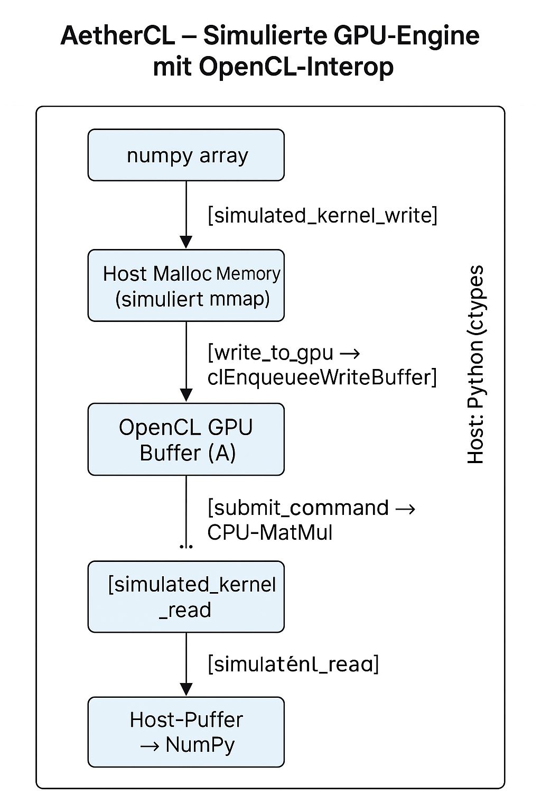

**AetherCL**

---

AetherCL ist eine GPU-Treiber-Simulations-Engine mit echter OpenCL-Interop, die Host↔GPU-Transfers, Kernel-Dispatch und Matrixoperationen realitätsnah abbildet. Ideal für Forschung, Deep-Learning-Prototyping und GPU-Architektursimulation. Plattformübergreifend, erweiterbar, bildungstauglich.

---

### 📘 Ausführliche `README.md` (Version 1.0, inklusive Diagramm-GIF-Platzhalter)

# AetherCL – Simulierte GPU-Engine mit OpenCL-Interop

**AetherCL** ist eine experimentelle, modulare C-basierte GPU-Treiber-Simulation mit echter Host↔GPU-Speicherinteraktion via OpenCL. Sie dient als Forschungssystem für Deep Learning, GPU-Architekturverständnis und realistische Prototyping-Szenarien – z. B. für Matrixoperationen, Kernel-Simulation oder Speicherverifikation.

---

## 🔍 Features

- ✅ Simulierte GPU-Speicherallokation (Host malloc + OpenCL Buffers)
- ✅ OpenCL-basierte Host→GPU→Host Transfers
- ✅ Matrixmultiplikation auf CPU mit echten GPU-Buffern
- ✅ Asynchrones Readback mit `clSetEventCallback`
- ✅ Rückgabe von Ergebnispuffern an Python über ctypes
- ✅ Modularer Aufbau mit klarer Host-/GPU-Trennung
- ✅ Kompatibel mit Windows, Linux (macOS optional)
- ✅ Ideal als LLM-Beschleuniger- oder Custom-Treiber-Basis

---

## 🧠 Zielsetzung

AetherCL richtet sich an:

- AI/ML-Forscher, die eigene Deep Learning Engines aufbauen
- Studierende, die GPU-Architektur realitätsnah verstehen wollen
- Entwickler, die OpenCL-basiertes Speicher- und Kernelmanagement simulieren
- Prototyping von Speicherpipelines, MMIO-Systemen, simulierten Dispatch-Systemen

---

## 🧪 Beispiel: Matrixmultiplikation via `simulated_matrix_multiply`

```python
A = np.random.rand(5, 4)
B = np.random.rand(4, 6)
C_addr = gpu.simulated_matrix_multiply(mmap_ptr_a, mmap_ptr_b, size_a, size_b, shape_a, shape_b)
C = gpu.read_data(C_addr, shape=(5, 6), dtype=np.float64)
```



> 💡 *Die Matrixmultiplikation erfolgt CPU-seitig, aber über echte OpenCL-GPU-Puffer, mit späterem asynchronem Readback!*

---

## 📐 Architektur

```plaintext
┌──────────────┐        Host: Python (ctypes)
│  numpy array │────┐
└──────────────┘    │
                    ▼
           [simulated_kernel_write]
                    │
                    ▼
          ┌────────────────────┐
          │ Host Malloc Memory │ (simuliert mmap)
          └────────────────────┘
                    │
                    ▼
        [write_to_gpu → clEnqueueWriteBuffer]
                    ▼
          ┌───────────────────────┐
          │ OpenCL GPU Buffer (A) │
          └───────────────────────┘
                         ...
        [submit_command → CPU-MatMul]
                         ...
        [clEnqueueReadBuffer → callback]
                    ▼
           [simulated_kernel_read]
                    ▼
           Host-Puffer → NumPy

```

---

## 🔧 Build

### Voraussetzungen

- OpenCL SDK (z. B. Intel, AMD, POCL, NVIDIA)
- GCC oder MSVC
- Python 3.12 mit `ctypes`
- Optional: `numpy` für die Python-Interaktion

### Kompilieren (Windows/GCC Beispiel)

```bash
gcc -I. -L. -shared -o simulated_driver.dll simulated_driver.c -lOpenCL -static-libgcc -static-libstdc++ -Wl,--export-all-symbols
```

---

## 🧪 Testen mit Python

```bash
python app.py
```

> Die Ausgabe zeigt detailreich den Ablauf jeder GPU-Simulation – von Allokation über Matrixmultiplikation bis zum Readback.

---

## 📁 Projektstruktur

```plaintext
├── simulated_driver.c         # Simulierter C-Treiber mit OpenCL-Bindung
├── app.py                     # Python Test Harness
├── README.md                  # Diese Datei
├── docs/
│   └── aethercl_architecture.png   # Diagramm (optional auch als GIF)
└── simulated_driver.dll       # Kompilierte Shared Library
```

---

## 🚀 Nächste Schritte (Vision)

- Echte GPU-Matrixkernel mit OpenCL C
- Simuliertes MMIO-Interface mit `mmap`
- Integration eines Memory Schedulers (z. B. für LLM)
- Erweiterung um Softmax, Conv2D, ReLU etc.
- Komplettes Command Dispatch System mit Scheduler-Logik

---

## 🤝 Lizenz

MIT License – Frei verwendbar für Lehre, Forschung, Entwicklung.

---

## 🧠 Inspiration

Dieses Projekt entstand aus der Vision, GPU-Verhalten auf systemnaher Ebene verständlich und kontrolliert zu simulieren – als Lernhilfe, Experimentierplattform und Brückentechnologie für AI-Systeme jenseits etablierter Frameworks wie CUDA oder TensorFlow.

---

## 📷 Beispiel-Visualisierung

*Hier kannst du z. B. ein GIF oder ein animiertes Diagramm einfügen, das die Abfolge „Host → Simuliert → GPU → Ergebnis“ zeigt.*

---

